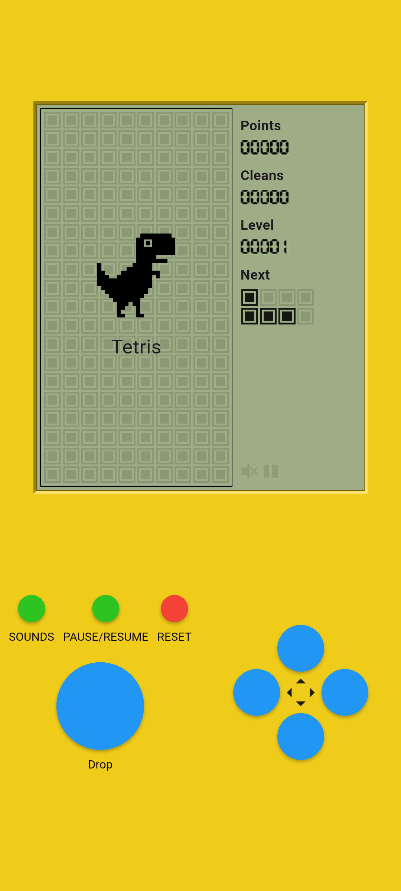
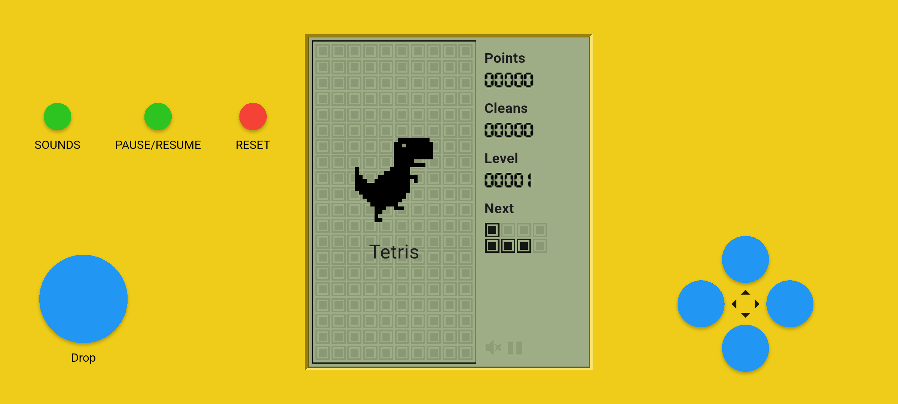

<h1 align="center">🧩 Tetris – Block Puzzle</h1>

  A classic Tetris-style puzzle game, reimagined with smooth touch controls and addictive gameplay.

---

## 📜 Overview

**Tetris – Block Puzzle** brings the timeless excitement of Tetris to your mobile device. Stack and clear lines, chase high scores, and enjoy minimalist, entertaining gameplay without the clutter.

---

## ✨ Features

- 🎮 **Classic Gameplay** – Easy to pick up, impossible to put down.  
- 📱 **Smooth Controls** – Designed for quick, responsive play.  
- ⚡ **Lightweight & Fast** – Loads instantly and runs without lag.  
- 🔒 **Privacy-Friendly** – No sign-ups, no tracking, just gaming.  

---

## 📸 Screenshots

  
  

---

## 📥 Installation

### **Android**
Get the game from Google Play:  

### **Windows / macOS (via Emulator)**
Run the APK using an Android emulator like **BlueStacks** or **NoxPlayer**.

---
